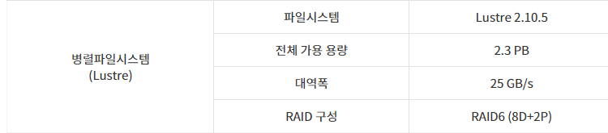

# 시스템 개요 및 구성

## 가. 시스템 운영 목적

\* 5호기 시스템이 Knight Landing 기반의 시스템으로 결정됨으로 GPU 기반의 시스템 운영을 통한 사용자의 다양한 수요 대응

\* 대형 메모리 필요 작업 수요 충족을 위한 대용량 메모리 노드 운영

## 나. 시스템 구성

**○ 계산노드**

뉴론 시스템의 계산노드는 기계학습/빅데이터 분야 및 GPU 활용 가속이 뛰어난 계산 과학 분야(분자동역학, 전자구조 계산 등)를 지원하기 위한 GPU 노드와 입출력 데이터 전후 처리를 위한 CPU\_only 노드, 대형 메모리 노드 수요 충족을 위한 대용량 메모리 노드로 구성이 되어 있다.

****

**GPU 노드**

GPU노드는 NVIDIA TESLA V100이 장착된 노드 36대와 A100이 장착된 노드 10대로 구성되어 있다. V100/A100 GPU는 PCIe와 NVLink 타입의 GPU가 장착되어 있다.

****

**CPU\_only 노드**

CPU\_only 노드는 총 10대이며, 2개의 Intexl Xeon Gold 6140 프로세서(코드명 Skylake)가 장착되어 있다. 기본 주파수는 2.3GHz이며 18개의 CPU 코어(hyperthreading off)로 구성된다. 각 CPU당 메모리는 96GB(노드 당 192GB)로 16GB DDR4-2666 메모리가 6채널로 구성되어 있다.

****

**대용량 메모리 노드**

512GB, 768GB, 1.5TB가 장착된 서버가 각각 1대씩 구성되어 있다. 512GB가 장착된 서버에는 4개의 Intexl Xeon E7-4870 프로세서(코드명 Westmere)가 장착되어 있으며 기본 주파수는 2.4GHz이며 10개의 CPU 코어(hyperthreading off)로 구성된다. 768GB가 장착된 서버에는 4개의 Intexl Xeon E7-4830 프로세서(코드명 Broadwell)가 장착되어 있으며 기본 주파수는 2.0GHz이며 14개의 CPU 코어(hyperthreading off)로 구성된다. 1.5TB가 장착된 서버에는 2개의 Intexl Xeon Gold 6246 프로세서(코드명 Cascade Lake)가 장착되어 있으며 기본 주파수는 3.3GHz이며 12개의 CPU 코어(hyperthreading off)로 구성된다.

****

**○ 로그인, 데이터무버 노드**

뉴론 시스템의 로그인노드는 V100 GPU카드를 1개씩 장착한 노드 2대로 구성되어 있으며, 개발환경 세팅 및 코드 개발 등을 수행할 수 있다. 데이터무버 노드는 입출력 데이터의 전송 및 wget, git을 이용한 외부 사이트로부터의 다운로드 등을 수행할 수 있다.

****

**○ 스토리지 구성도**

Neuron 스토리지는 DDN SFA12K-40 모델로 10개의 Enclosure SS8460(Disk Box)와 10대의 ORACLE X3-2L 서버(MDS 2대, OSS 8대)로 구성되어 있다. 병렬분산파일시스템인 Lustre를 이용하여 구성되어 있으며 실제 가용 용량은 약 2.3PB이다. 단일 파일시스템에 홈 디렉터리(/home01), 어플리케이션 디렉터리(/apps), 스크래치 디렉터리(/scratch2)가 나누어 설정되어 있으며, 로그인 노드(Login Nodes), 계산노드(Computing Nodes)에 마운트 되어있다.

![\[ Neuron 스토리지 구성도 \]](<../.gitbook/assets/Neuron 스토리지 구성도.png>)


2022년 3월 18일에 마지막으로 업데이트되었습니다.

