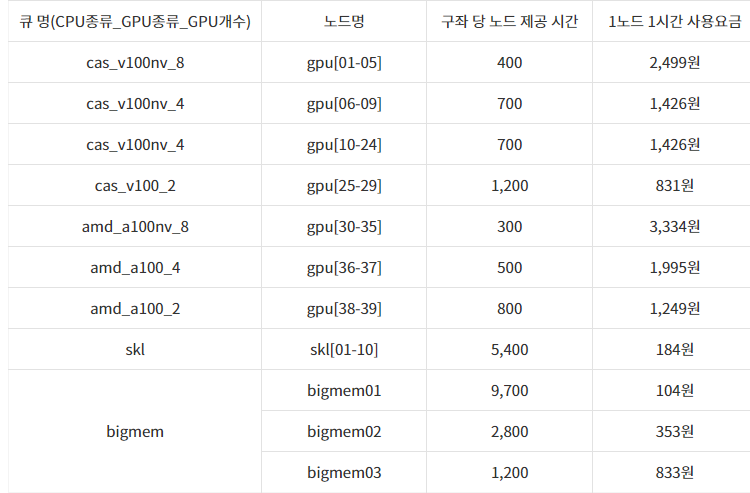

# 사용자 환경

## 가. 계정발급

① 뉴론(NEURON) 시스템의 사용을 승인받은 연구자는 KISTI 홈페이지([https://www.ksc.re.kr](https://www.ksc.re.kr/)) 웹 서비스를 통해 계정을 신청한다.

\* 신청 방법 : KISTI 홈페이지 웹사이트접속, (상단) 사용신청 -> (상단) 신청 -> 신청서선택

\- 무료계정 : 누리온 시스템 혁신지원 프로그램, 초보사용자

\- 유료계정 : 일반사용자, 학생사용자

\- 계정 발급 완료 시 신청서에 기입한 이메일로 계정 관련 정보 발송


② OTP (One Time Password, 일회용 비밀번호) 인증코드 발급

\- **수신하신 계정 정보 이메일을 참고하여** 아래와 같이 작성하여 [account@ksc.re.kr](mailto:account@ksc.re.kr)을 통해 인증코드를 발급받는다.

| 메일 제목    | <p>OTP 인증코드 발송 요청 - 사용자 ID</p><p>(예) OTP 인증코드 발송 요청 - x123abc</p>                             |
| -------- | --------------------------------------------------------------------------------------------- |
| 수신인      | [account@ksc.re.kr](mailto:account@ksc.re.kr)                                                 |
| 메일내용(예제) | <p>로그인 ID: x123abc</p><p>휴대폰번호: 010-1234-5678</p><p>이름: 홍길동</p><p>통신사: LG 유플러스(or SKT/KT)</p> |


③ OTP 앱 설치

\- 슈퍼컴퓨팅 보안 접속을 위해 OTP 스마트폰 앱이 제공된다.

\- OTP 스마트폰 앱은 안드로이드 앱 스토어(Google Play)나 아이폰 앱 스토어(App Store)에서 “Any OTP”로 검색 후 미래기술(mirae-tech)에서 개발한 앱을 설치하여 사용할 수 있다.

\- 슈퍼컴퓨터 로그인 시 “Any OTP” 앱의 OTP 보안숫자를 반드시 입력해야 한다.


※ 스마트폰을 사용하고 있지 않은 사용자의 경우, 계정담당자(account@ksc.re.kr)에게 문의

※ 자세한 OTP 설치 및 이용방법은 KISTI 홈페이지 > 기술지원 > 지침서에서 “OTP 사용자 매뉴얼” 참조

※ LG 유플러스의 경우에는 문자가 스팸처리되므로 이메일로 안내

## 나. 로그인

\- 사용자는 뉴론 시스템 로그인 노드(neuron01.ksc.re.kr, neuron02.ksc.re.kr)를 통해서 접근이 가능하다(하단, 노드 구성 참조).

\- 기본 문자셋(encoding)은 유니코드(UTF-8)이다.

\- 로그인 노드에 대한 접근은 ssh, scp, sftp, X11 만 허용된다.


① 유닉스 또는 리눅스 환경

```
$ ssh -l <사용자ID> neuron01.ksc.re.kr -p 22
```

\- \[-p 22]: 포트번호 명시를 위한 것으로 생략가능

\- X환경 실행을 위해 XQuartx 터미널을 이용

※ 프로그램은 인터넷을 통해 무료로 다운로드 후 설치


② 윈도우 환경

\- X환경 실행을 위해 Xming 실행

※ 프로그램은 인터넷을 통해 무료로 다운로드 후 설치

.png>)

\- putty, Mobaxterm, 또는 SSH Secure Shell Client 등의 ssh 접속 프로그램을 이용

※ 프로그램은 인터넷을 통해 무료로 다운로드 가능

※ Host Name : neuron.ksc.re.kr, Port : 22, Connection type : SSH

&#x20;&#x20;


※ ssh -> X11 tap -> check “Enable X11 forwarding”

※ X display location : localhost:0.0


※ 만약, DNS 캐싱 문제로 접속이 안 될 경우에는 캐시를 정리

(명령 프롬프트에서 ipconfig /flushdns 명령어 수행)하고 재접속

```
C:￦> ipconfig /flushdns
```


③ 파일 송수신

\- FTP 클라이언트를 통해 ftp(OTP 없이 접속가능)나 sftp로 접속하여 파일을 송수신 한다.

```
$ ftp neuron-dm.ksc.re.kr
또는
$ sftp [사용자ID@]neuron-dm.ksc.re.kr [-P 22]
```

\- 윈도우 환경에서는 WinSCP와 같이 무료로 배포되고 있는 FTP/SFTP 클라이언트 프로그램을 이용하여 접속한다.


\* FTP (File Tranfer Protocal)을 이용하며, OTP를 입력하지 않고 파일 전송 가능

\* SFTP(Secure-FTP) 을 이용하며, 파일 전송시 OTP를 입력해야함.(FTP보다 안전한 전송방식)


④ 노드구성

|                  | **호스트명**                                                                      | **CPU Limit** | **비고**                                                                                                                     |
| ---------------- | ----------------------------------------------------------------------------- | ------------- | -------------------------------------------------------------------------------------------------------------------------- |
| **로그인 노드**       | <p><strong>neuron.ksc.re.kr</strong></p><p><em>: V100 GPU 카드 1개 장착노드</em></p> | 120분          | <p><strong>• ssh/scp 접속 가능</strong></p><p><strong>• 컴파일 및 batch 작업제출용</strong></p><p><strong>• ftp/sftp 접속 불가</strong></p> |
| **Datamover 노드** | **neuron-dm.ksc.re.kr**                                                       | -             | <p><strong>• ssh/scp/sftp/ftp 접속 가능</strong></p><p><strong>• 컴파일 및 작업제출 불가</strong></p>                                    |

\* DM 노드에는 Nurion의 홈디렉터리(/nurion\_home01/\[userid])와 스크래치디렉터리(/nurion\_scratch/\[userid])가 마운트되어 있어서 두 시스템에서 동일 userid를 사용할 경우 시스템 간 파일 이동이 가능함.

\* wget, git을 이용한 다운로드 및 대용량 데이터의 전송은 CPU Limit이 없는 Datamover 노드를 사용할 것을 권장함 (로그인 노드에서 수행 시에 CPU Limit에 따라 전송 중에 끊어질 수 있음)


<mark style="color:red;">⑤ 디버깅 노드 제공</mark>

<mark style="color:red;">\* 디버깅, 컴파일, 수행코드 테스트 등의 목적으로 2개의 GPU 노드 제공(실제 작업 수행은 제한함)</mark>

<mark style="color:red;">\* 각 노드당 2개의 CPU(Xeon2.9GHz/32Cores)와 2개의 GPU(V100)가 장착되어 있음</mark>

<mark style="color:red;">\* 로그인 노드(glogin\[01.02])에서 ssh로 직접 접속 가능하며(#ssh gpu27 또는 gpu28), 스케줄러를 통한 서비스는 더 이상 지원하지 않음</mark>

## 다. 사용자 쉘(shell) 변경

\- 뉴론 시스템의 로그인 노드는 기본 쉘로 bash이 제공된다. 다른쉘로 변경하고자 할 경우 chsh 명령어를 사용한다.

```
$ chsh
```

\- 현재 사용 중인 쉘을 확인하기 위해서 echo $SHELL을 이용하여 확인한다.

```
$ echo $SHELL
```

\- 쉘의 환경설정은 사용자의 홈 디렉터리에 있는 환경설정 파일(.bashrc, .cshrc 등)을 수정하여 사용하면 된다.

## 라. 사용자 비밀번호 변경

\- 사용자 패스워드를 변경하기 위해서는 로그인 노드에서 passwd 명령을 사용한다.

```
$ passwd
```

※ 패스워드 관련 보안 정책

ㅇ 사용자 패스워드 길이는 최소 9자이며, 영문, 숫자, 특수문자의 조합으로 이뤄져야 한다. 영문 사전 단어는 사용이 불가하다.

ㅇ 사용자 패스워드 변경 기간은 2개월로 설정(60일) 된다.

ㅇ 새로운 패스워드는 최근 5개의 패스워드와 유사한 것을 사용 할 수 없다.

ㅇ 최대 로그인 실패 허용 횟수 : 5회

\- 5회 이상 틀릴 경우, 이 계정의 ID는 lock이 걸리므로, 계정담당자([acccount@ksc.re.kr](mailto:acccount@ksc.re.kr))에게 문의해야 한다.

\- 같은 PC에서 접속을 시도하여 5회 이상 틀릴 경우, 해당 PC의 IP 주소는 일시적으로 block 되므로 이 경우에도 계정담당자([account@ksc.re.kr](mailto:account@ksc.re.kr))에게 문의해야 한다.

ㅇ OTP 인증오류 허용 횟수 : 5회

\- 5회 이상 틀릴 경우, 계정담당자([account@ksc.re.kr](mailto:account@ksc.re.kr))에게 문의해야 한다.

## 마. 제공 시간



**※ 공유 노드 정책으로 인하여 작업이 사용한 core, gpu 개수만큼 과금 부과**

## 바. 작업 디렉터리 및 쿼터 정책

\- 홈 디렉터리 및 스크래치 디렉터리에 대한 정보는 아래와 같다.


\* NEURON시스템은 백업을 지원하지 않음.

\- 홈 디렉터리는 용량 및 I/O 성능이 제한되어 있기 때문에, 모든 계산 작업은 스크래치 디렉터리인 /scratch의 사용자 작업 공간에서 이루어져야 한다.

\- 사용자 디렉터리 용량 확인 (login 노드에서 실행)

```
$ quotainfo
```



2022년 5월 26일에 마지막으로 업데이트되었습니다.

