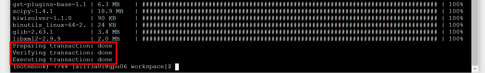
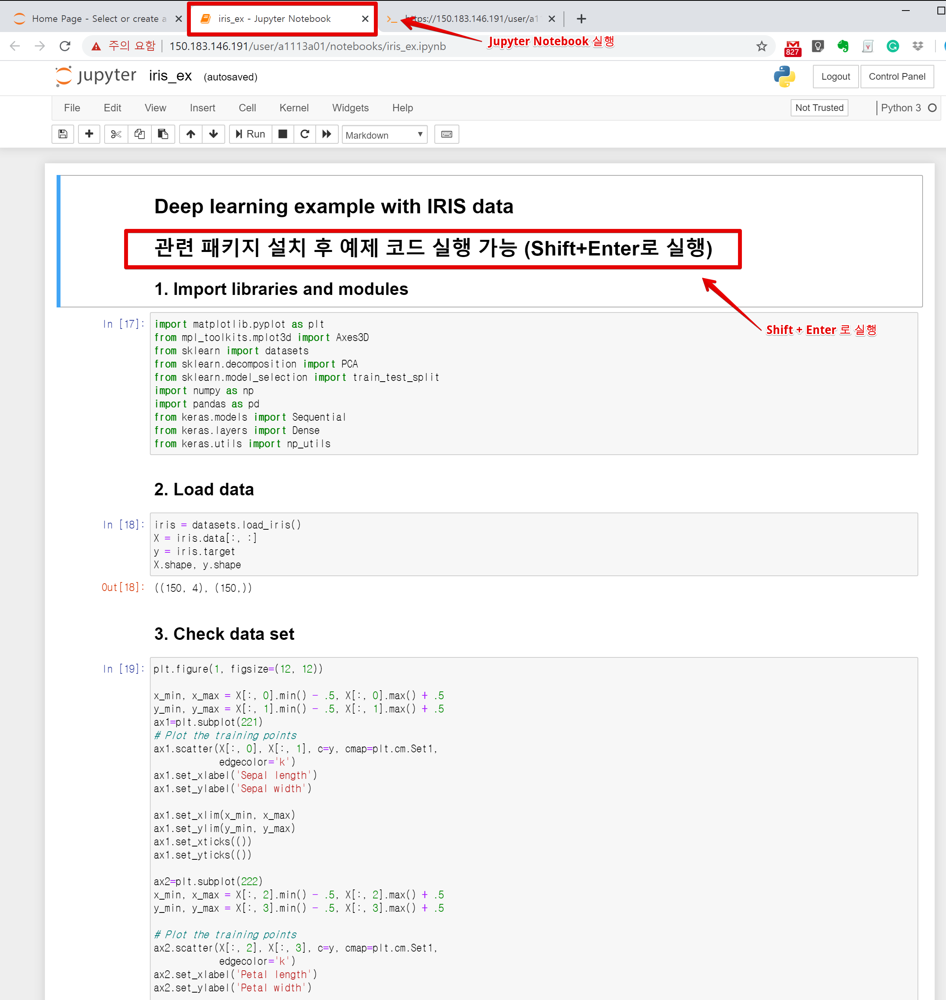
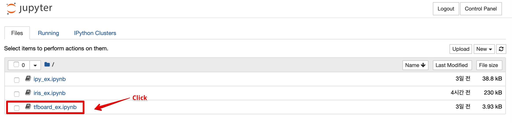
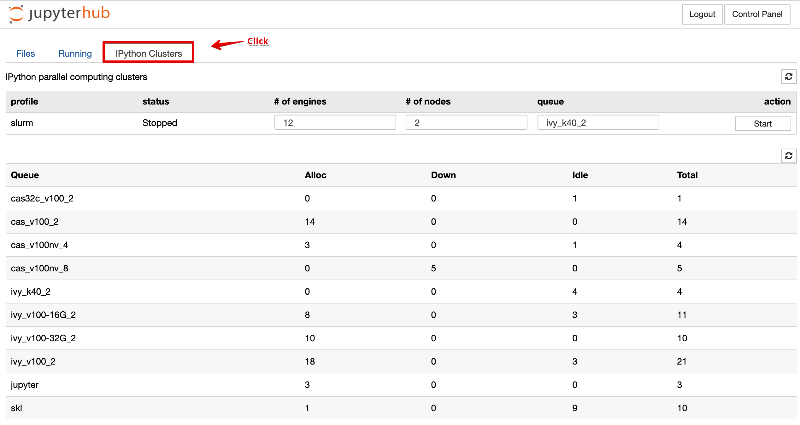
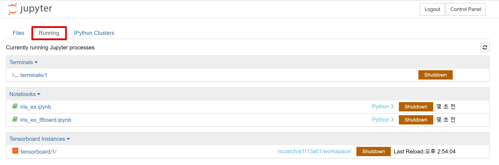

# 뉴론 Jupyter 사용법

## 가. Jupyter 개요

**1) JupyterHub**

○ JupyterHub 란 멀티 사용자 환경에서 주피터 랩/노트북을 사용할 수 있는 오픈소스 소프트웨어를 뜻한다.\
○ JupyterHub는 다양한 환경 (JupyterLab, Notebook, RStudio, Nteract 등)을 지원할 뿐만 아니라 인증 서버 (OAuth, LDAP, GitHub 등) 및 배치 스케줄러와도 (PBSPro, Slurm, LSF 등) 유연하게 연동 가능하다.\
○ JupyterHub는 컨테이너 관리 플랫폼인 Kubernetes와도 연동이 쉬워 컨테이너 기반의 클라우드 환경에 쉽게 연동 가능하다.

※ Neuron 기반 JupyterHub는 5호기 Bright LDAP, OTP 인증기능을 추가하였고 Slurm 배치 스케줄러와 연동하여 자원을 할당하여 Jupyter 실행하고 현재 default로 Jupyter Notebook을 제공하고 추가로 JupyterLab 제공한다.

**2) Jupyter Notebook**

○ Jupyter Notebook은 웹 기반의 오픈소스 어플리케이션으로 프로그래머들에게 문서 생성, 코드 생성 및 실행, 수학적 라이브러리를 사용한 데이터 시각화, 통계 모델링, 머신러닝/딥러닝 프로그래밍에 사용한다.\
○ 40 여개의 프로그래밍 언어 즉 Python, R, Julia, Scala등을 지원한다.\
○ 프로그래밍 언어로 작성한 코드는 HTML, 이미지, 동영상 파일, LaTeX 등 다양한 타입으로 변환 가능하다.\
○ Apache Spark, Pandas, Scikit-learn, ggplot2, Tensorflow 등 다양한 툴/라이브러리들과 연동 가능하다.


**3) JupyterLab**

○ JupyterLab은 Jupyter Notebook 인터페이스에 사용자 편의를 위한 기능들을 추가하여 확장 가능한 모듈로 구성된다.\
○ Jupyter Notebook과 달리 하나의 작업 화면에 Tabs 와 Splitters를 사용하여 여러 개의 도큐먼트 또는 다른 기능을 제공한다.


**4) IPyParallel**

○ IPyParallel 프로젝트는 인터렉티브 클러스터 컴퓨팅을 위한 파이썬 모듈로 인터렉티브 파이썬 병렬환경을 제공한다.\
○ Jupyter Notebook에 플러그인으로 확장가능하며 IPython Clusters Tab으로 Jupyter Notebook을 통해 사용 가능하다.


## 나. 스크립트를 통한 Jupyter 실행


<mark style="color:red;">※ 최초 한번만 실행하며 환경설정이 완료되면 즉시 웹 페이지 접속하여 (나. JupyterHub 웹 페이지 접속 참고) JupyterLab/Notebook을 사용 가능하다.</mark>

**1) 스크립트 실행**

\
\- 터미널로 로그인 노드 (<mark style="color:red;">**neuron.ksc.re.kr**</mark>) 에 접속하여 다음 스크립트 /apps/jupyter/kisti\_conda\_jupyter.sh 를 실행한다.\
\- 스크립트를 실행하면 <mark style="color:red;">**/scratch/\[사용자ID]/.conda/envs**</mark> 디렉터리에 notebook Conda 환경이 만들어지고 jupyterhub, JupyterLab, Notebook, Tensorflow, ipyparallel 패키지들이 자동으로 설치되고 멀티 GPU 환경에 필요한 cudatoolkit=10.0 과 cudnn이 설치된다. (약 8분 소요)

\
**※ 이 파일은 한번만 실행하면 되고 그 다음부터는 바로 웹 페이지 접속하여 사용 가능하다.**\
※ 실행파일은 공유 디렉터리에서 /apps/jupyter/kisti\_conda\_jupyter.sh 로 바로 실행 가능하다.\
※ 아래 테스트는 사용자ID _<mark style="color:red;">**a1113a01**</mark>_ <mark style="color:red;"></mark><mark style="color:red;"></mark> 로 진행하였다.

```
[a1113a01@glogin02 ~]$ sh /apps/jupyter/kisti_conda_jupyter.sh
... ...
modified /home01/a1113a01/.bashrc
...prepare conda environment for jupyter user.
Exporting CONDA ENVS and PKGS PATH to bash File.
Downloading and Extracting Packages
#################################################################### | 100%
#################################################################### | 100%
#################################################################### | 100%
#################################################################### | 100%
Preparing transaction: done
Verifying transaction: done
Executing transaction: / WARNING conda.core.prefix_data:_load_single_record(167):
Ignoring malformed prefix record at:
/scratch/a1113a01/.conda/envs/notebook/conda-meta/001.pycurl-7.43.0.5-py37h16ce93b_0.json
done
```


\- shell을 다시 시작하고 base 환경 자동 활성화 기능을 꺼야 한다. (한번만 실행)

```
[a1113a01@glogin01 ~]$ source ~/.bashrc
(base) [a1113a01@glogin01 ~]$ conda config --set auto_activate_base false
(base) [a1113a01@glogin01 ~]$ conda deactivate
```

※ base 환경 자동 활성화 기능을 false 로 설정함으로 다음에 base 환경으로 자동 활성화 되는 것을 방지한다. （만약 base 환경으로 활성화 되지 않았으면 source \~/.bashrc 이후 바로 conda activate notebook 명령어를 실행)


\- conda notebook 환경을 다음 명령어로 활성화 한다.

```
[a1113a01@glogin01 ~]$ conda activate notebook
(notebook) [a1113a01@glogin01 ~]$
```


\- Tensorboard와 IPyParallel 사용을 원하는 사용자는 웹 페이지에 접속하기 전에 Jupyter notebook/JupyterLab 용 tensorboard와 ipyparallel 확장 패키지를 설치해야 한다. KISTI에서 제공하는 자동 설치 스크립트 /apps/jupyter/kisti\_conda\_plugins.sh 를 실행하여 설치할 수 있다. (약 5분 소요)

※ 주의: 반드시 notebook 사용자 환경에서 실행해야 한다.

```
(notebook) 757% [a1113a01@glogin01 ~]$ sh /apps/jupyter/kisti_conda_plugins.sh
Installing /scratch/a1113a01/.conda/envs/notebook/lib/python3.7/site-packages/ipyparallel/nbextension/static -> ipyparallel
Up to date: /scratch/a1113a01/.conda/envs/notebook/share/jupyter/nbextensions/ipyparallel/clusterlist.css
Up to date: /scratch/a1113a01/.conda/envs/notebook/share/jupyter/nbextensions/ipyparallel/clusterlist.js
Up to date: /scratch/a1113a01/.conda/envs/notebook/share/jupyter/nbextensions/ipyparallel/main.js
- Validating: OK
To initialize this nbextension in the browser every time the notebook (or other app) loads:

jupyter nbextension enable ipyparallel --py --sys-prefix

Enabling tree extension ipyparallel/main...
- Validating: OK
Enabling: ipyparallel.nbextension
- Writing config: /scratch/a1113a01/.conda/envs/notebook/etc/jupyter
- Validating...
ipyparallel.nbextension OK
[ProfileCreate] Generating default config file: '/home01/a1113a01/.ipython/profile_slurm/ipython_config.py'
[ProfileCreate] Generating default config file: '/home01/a1113a01/.ipython/profile_slurm/ipython_kernel_config.py'
[ProfileCreate] Generating default config file: '/home01/a1113a01/.ipython/profile_slurm/ipcontroller_config.py'
[ProfileCreate] Generating default config file: '/home01/a1113a01/.ipython/profile_slurm/ipengine_config.py'
[ProfileCreate] Generating default config file: '/home01/a1113a01/.ipython/profile_slurm/ipcluster_config.py'
```

※ 이제부터 사용자는 직접 웹에 접속하여 Jupyter 노트북을 사용할 수 있다. (여기까지 작업들은 한번만 실행하면 됨)


**2) JupyterHub 웹 페이지 접속**\
\- [<mark style="color:red;">https://jupyter.ksc.re.kr</mark>](https://jupyter.ksc.re.kr/) 에 접속하여 신청 받은 뉴런 계정, OTP, 비밀번호를 입력한다.


\- 메인 화면에서 자원 사용현황 확인 및 Refresh 버튼을 클릭하여 자원 사용 현황을 업데이트 할 수 있다.

.png>)

**3) 큐 (Queue) 선택 및 Jupyter 실행**

\
\- Jupyter를 실행하기 전에 <mark style="color:red;">**Refresh**</mark> 버튼을 클릭하여 자원 현황을 확인\
◦ Alloc: 사용중인 노드 개수\
◦ Idle: 사용가능한 노드 개수\
◦ Down: 사용불가한 노드 개수\
◦ Total: 전체 노드 개수

\
\- Queue 정보 확인\
◦ jupyter queue (무료): 환경 설치, 전처리, 디버깅 용도\
◦ other queues (유료): 딥러닝/머신러닝 등 모델 실행 및 시각화 용도

※ jupyter queue는 현재 5개 노드로 최대 50개(노드 당 10개) Jupyter Notebook 실행 가능함 (여러 사용자가 노드의 CPU+GPU\[v100] 공유)\
※ jupyter 큐외 other queues 들은 1개 노드를 독점하여 Jupyter Notebook을 실행함으로 노드의 GPU자원을 최대로 사용할 수 있다. (뉴론 과금 표를 참고)\
※ 유료 과금 정책은 기존 Neuron 시스템 과금 정책을 따르고 정보는 국가슈퍼컴퓨팅 홈페이지 요금안내 페이지 ([https://www.ksc.re.kr/jwjg/gjbg/ygan](https://www.ksc.re.kr/jwjg/gjbg/ygan)) 에서 확인 가능하다.

\- Job queue 에서 해당 queue를 선택하고 Submit버튼을 클릭하여 Jupyter Notebook 실행 (other queues로도 실행 가능하나, 다만 과금 발생함, 과금 정보는 KSC 홈페이지 Neuron 과금 정보 참고)

 선택 및 Jupyter 실행.png>)

\- 다음과 같은 화면이 몇 초간 진행 되면서 자원 할당이 진행된다.

 선택 및 Jupyter 실행(1).png>)

\- Default로 https://jupyter.ksc.re.kr/user/a1113a01/tree Jupyter Notebook 화면이 실행된다.

 선택 및 Jupyter 실행(2).png>)



## 다. Jupyter Notebook 사용 방법

**1) Jupyter 작업 환경**

<mark style="color:red;">**◦ Jupyter 환경 디렉터리: /scratch/\[사용자ID]/.conda/envs/notebook**</mark>\ <mark style="color:red;"></mark><mark style="color:red;">**◦ 로그 저장 디렉터리: /scratch/\[사용자ID]/log/작업ID.log**</mark>\ <mark style="color:red;"></mark><mark style="color:red;">**◦ 작업 파일 저장 디렉터리: /scratch/\[사용자ID]/workspace/**</mark>

※ 사용자는 본인이 필요로 하는 머신러닝/딥러닝 라이브러리들을 .../notebook conda 환경에 설치하기 때문에 기본 쿼터가 큰 /scratch/사용자ID/ 에 설치된다. (Jupyter 실행 후 발생하는 로그파일도 /scratch/사용자ID 에 저장)\
※ 사용자가 작성한 코드는 /scratch/사용자ID/에 저장된다.\
※ conda 환경 백업을 위한 conda 환경 내보내기 및 가져오기 관련 정보는 KISTI 홈페이지 소프트웨어 지침서에서 확인할 수 있다.


**2) Jupyter Notebook 사용 방법**

\- Menu Bars는 Files/Running/IPython Clusters로 구성되어 있다.


\- Menu Bar -> Running 은 현재 실행 중인 세션들을(Terminal, Notebook, Tensorboard) 모니터링 하고 삭제 가능하다.

.png>)

\- Menu Bar -> IPython Clusters 는 프로파일 기반 파이썬 병렬 엔진을 시작/종료 가능하다. (IPython Parallel 프로파일 작성 방법은 라. IPyParallel 실행 부분 참고)


\- New 클릭 시 Python3/Text File/Floder/Terminal/Tensorboard 신규 생성이 가능하다.

.png>)

**3) JupyterLab 전환 방법**

\
\- 웹 브라우저에 다음과 같이 주소 끝에 tree를 lab으로 수정하면 JupyterLab으로 전환 가능하다.\
\- Notebook 화면 https://jupyter.ksc.re.kr/user/a1113a01/tree


\- JupyterLab 화면 https://jupyter.ksc.re.kr/user/a1113a01/lab

※ JupyterLab 자세한 사용 방법은 부록 1 참고

## 라. 머신러닝/딥러닝 예제 코드 실행하기

**1) 예제 코드 실행에 필요한 라이브러리 설치**

\- New->Terminal 클릭하여 머신러닝/딥러닝에 필요한 라이브러리 설치한다.


\- 터미널 환경에서 conda activate notebook 명령어로 notebook 환경을 활성화하고 notebook 환경에 필요한 라이브러리를 설치한다.\
※ 반드시 notebook conda 환경에 설치해야 Jupyter 웹 화면에 적용된다.


\- notebook 환경에 사용자가 원하는 머신러닝/딥러닝 관련 라이브러리 설치 (본 예제는 머신러닝 프레임워크 Keras, pandas, numpy, scipy 등 흔히 사용하는 라이브러리들을 conda로 설치하는 과정이며, 본 예제 필요한 라이브러리 설치 시 약 7분 소요)

| <p>772% [a1113a01@gpu06 workspace]$ conda activate notebook<br>(notebook) 773% [a1113a01@gpu06 workspace]$ conda install theano keras graphviz numpy scipy scikit-learn matplotlib pandas pydot -y</p> |
| ------------------------------------------------------------------------------------------------------------------------------------------------------------------------------------------------------ |


\- 설치 완료 확인



**2) 예제 코드 작성 및 실행**

\- Home Page 로 돌아가 Menu Bare-> Files 에서 예제 파일 iris\_ex.ipynb를 클릭한다.


\- Jupyter Notebook이 실행되고 Shift+Enter로 예제 코드를 실행한다.



※ 실행 과정에 나오는 warning 들은 무시 가능하며, 동일 코드 재실행 시 warning 메시지 출력되지 않는다. (warning 내용은 코딩 시 버전에 따른 문법적 제시 안내)

\- matplotlib 라이브러리를 사용한 그래프 출력


**3) Tensorboard 실행**

\
\- Menu Bar -> Files 에서 tfboard\_ex.ipynb를 클릭한다.



\- Shifter+Enter로 코드 실행한다. (약1분 소요)


\- Tensorboard 실행, Home Page->New->Tensorboard->Current directory를 클릭한다.\
※ Files 에 logs 폴더가 생성되며 여기에 로그 데이터가 여기에 저장된다.


※ 혹은 logs 폴더를 클릭한 후 Tensorboard 버튼이 생성되면 클릭


\- TensorBoard -> Scalars


\- TensorBoard -> Graphs


\- TensorBoard -> Distributions


\- TensorBoard -> Histograms


**4) IPyParallel 실행**

\
\- Menu Bar에서 IPython Clusters 탭을 클릭한다.



\- slurm 프로파일에 engine, node, queue 정보를 입력한다.\
engine: 병렬 프로세스 개수\
node: 할당할 계산 노드 개수\
queue: 병렬 작업을 제출할 큐 이름 (아래 자원 현황을 보고 선택)


\- start 버튼으로 병렬 엔진 생성, 새로 고침하여 확인한다.


**5) IPyParallel 예제 코드 실행**

\
\- Menu Bar -> Files -> ipy\_ex.ipynb를 클릭한다.


**6) 새로운 Launcher 만들기 및 Python 코드 작성**

\
\- 아래와 같이 New -> Python 3 메뉴를 클릭하여 새로운 Python 코드의 작성이 가능하다.


\- Python 3 커널을 사용할 수 있는 새로운 Jupyter Notebook Launcher가 실행된다.


## 마. Jupyter 종료 방법

**1) 실행중인 세션 종료**

\- 다음 그림과 같이, Running 탭을 클릭하여 실행중인 Terminal Sessions 이나 Kernel, Tensorboard Sessions들을 Shutdown 버튼을 클릭하여 종료한다.



※ 세션을 종료시키지 않고 JupyterHub 웹페이지를 종료하는 경우, 다음 Jupyter 실행 시에도 그대로 남아있게 된다. (과금은 진행되지 않음)

**2) Jupyter 종료**

\
\- (Jupyter Notebook) Control Panel -> Stop My Server를 클릭한다.


<mark style="color:red;">※ 홈페이지 Logout 시 실행중인 Jupyter 및 세션들은 모두 자동으로 종료된다.</mark>

## 바. Jupyter 환경 초기화 방법

※ conda 가상 환경 notebook 에 pip 으로 설치 할 경우 기존 conda install 로 설치한 패키지들과 버전 충돌이 발생하여 Jupyter 노크북이 실행이 안될 경우 다음과 같은 명령어로 환경 초기화를 해줄 수 있다.

\- 터미널로 로그인 노드에서 /apps/jupyter/reset\_env.sh 를 실행한다.

\- 해당 스크립트를 실행하면 /scratch/\[사용자ID]/.conda/envs 디렉터리에 만들어졌던 notebook 가상환경에 설치되었던 모든 패키지들이 삭제되고 처음 jupyter 실행을 위한 기본 패키지들이 다시 설치 된다.

\- /sratch/\[사용자ID]/workspace/에 데이터는 보존된다.

```
[a1113a01@glogin02 ~]$ sh /apps/jupyter/reset_env.sh
Remove all packages in environment /scratch/a1113a01/.conda/envs/notebook:
Preparing transaction: done
Verifying transaction: done
Executing transaction: / WARNING conda.core.prefix_data:_load_single_record(167): Ignoring malformed prefix record at: /scratch/acnta03/.conda/envs/notebook/conda-meta/001.pysocks-1.7.1-py37hc8dfbb8_1.json
done

One more step left, please execute these commands !!!!!!!
1. conda activate notebook
2. sh /apps/jupyter/kisti_conda_plugins.sh

[a1113a01@glogin02 ~]$ conda activate notebook
(notebook) [a1113a01@glogin02 ~]$ sh /apps/jupyter/kisti_conda_plugins.sh
```

\- https://jupyter.ksc.re.kr 홈페이지로 접속하여 jupyter 실행하여 잘 동작하는지 확인한다.



## \[참조 사항]

**1) Jupyter Notebook에서 JupyterLab으로 전환**

\
\- 웹 브라우저에 https://jupyter.ksc.re.kr/user/a1113a01/tree 대신 https://jupyter.ksc.re.kr/user/a1113a01/lab 으로 주소를 수정하고 이동한다.

\- Terminal 실행, Launcher 탭에서 Terminal 아이콘을 클릭한다.\
※ Launcher 탭이 보이지 않을 경우 Menu Bars에서 + 아이콘을 클릭한다.


\- Tensorboard 실행, Menu Bars->+아이콘->Launcher->Tensorboard를 클릭한다.


**2) 실행중인 세션 종료**

\- 다음과 같이, Left Side Bar에서 Session 탭을 클릭하여 실행중인 Terminal Sessions 이나 Kernel Sessions들을 Shut Down 버튼을 클릭하여 종료한다.

※ 세션을 종료시키지 않고 JupyterHub 웹페이지를 종료하는 경우, 다음 Jupyter 실행 시에도 그대로 남아있게 된다. (과금은 진행되지 않음)


**3) Jupyter 종료**

\- (JupyterLab) Jupyter 사용이 끝나면 반드시 Jupyter를 종료시켜 자원을 반납해야 한다. 반납하는 방법은 File -> Hub Control Panel 클릭하여 Home 페이지로 와서 Stop My Server 클릭하여 자원을 반납할 수 있다.





2022년 4월 15일에 마지막으로 업데이트되었습니다.

