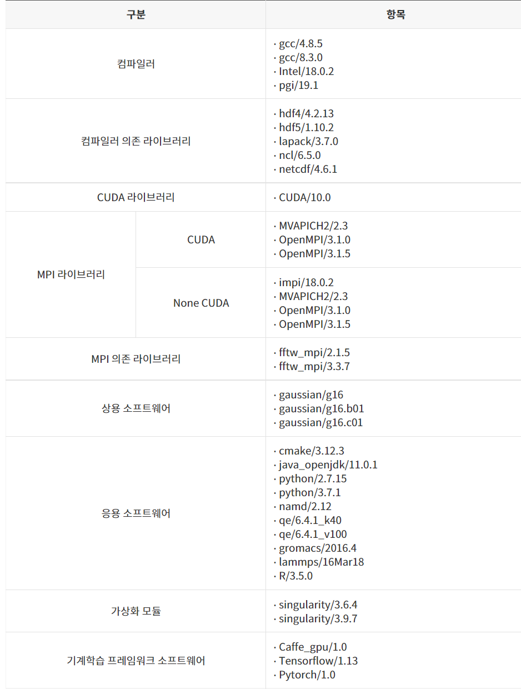

# 사용자 프로그래밍 환경

## 가. 프로그래밍 도구 설치 현황



※ Neuron시스템에서의 인공지능 프레임워크는 anaconda 환경을 사용하는 것을 권장하며,

사용자 요구 기반의 컨테이너 이미지 구동을 위한 싱귤레리티 활용 환경을 제공할 예정

※ 싱귤레러티 활용: ‘\[별첨4]싱귤레러티 컨테이너 이미지 사용법’을 참조

<mark style="color:red;">**※ GPU가 장착되지 않은 노드를 사용하기 위해서는 None CUDA MPI 라이브러리를 사용해야 한다.**</mark>

## 나. 컴파일러 사용법

#### 1) 컴파일러 및 MPI 환경설정(modules)

#### (1) 모듈 관련 기본 명령어

<mark style="color:blue;">**\* 사용자 편의를 위해 "module" 명령어는 "ml" 명령어로 축약하여 사용할 수 있음**</mark>


ㅇ 사용 가능한 모듈 목록 출력

사용할 수 있는 컴파일러, 라이브러리 등의 모듈 목록을 확인할 수 있다

```
$ module avail
혹은
$ module av
```


ㅇ 사용할 모듈 추가

사용하고자 하는 컴파일러, 라이브러리 등의 모듈을 추가할 수 있다.

사용할 모듈들을 한번에 추가할 수 있다.

```
$ module load [module name] [module name] [module name] ...
혹은
$ module add [module name] [module name] [module name] ...
혹은
$ ml [module name] [module name] [module name] ...  
ex) ml gcc/4.8.5 singularity/3.9.7 
```


ㅇ 사용 모듈 삭제

필요 없는 모듈을 제거한다. 이 때 한번에 여러 개의 모듈을 삭제할 수 있다.

```
$ module unload [module name] [module name] [module name] ...
혹은
$ module rm [module name] [module name] [module name] ...
혹은
$ ml -[module name] -[module name] -[module name] ...     
ex) ml -gcc/4.8.5 -singularity/3.9.7 
```


ㅇ 사용 모듈 목록 출력

현재 설정된 모듈 목록을 확인할 수 있다.

```
$ module list
혹은
$ module li
혹은
$ ml
```


ㅇ 전체 사용 모듈 일괄 삭제

```
$ module purge
```


ㅇ 모듈 설치 경로 확인

```
$ module show [module name]
```


ㅇ 모듈 찾기

```
$ module spider  [module | string | name/version ]
```


ㅇ 사용자 모듈 모음(collection) 저장 관리

```
# 현재 로드된 모듈들을 default 모듈 모음에 저장하며, 다음 로그인 시 자동 로드됨
$ module save  
# 현재 로드된 모듈들을 지정된 이름을 가진 사용자 모듈 모음으로 저장함                  
$ module save [name]  
# 사용자 모듈 모음을 로드함        
$ module restore [name]    
# 사용자 모듈 모음의 내용을 출력함  
$ module describe [name]    
# 사용자 모듈 모음 리스트를 출력함  
$ module savelist  
# 사용자 모듈 모음을 삭제함             
$ module disable [name]     
```

#### 2) 순차 프로그램 컴파일

순차 프로그램은 병렬 프로그램 환경을 고려하지 않은 프로그램을 말한다. 즉, OpenMP, MPI와 같은 병렬 프로그램 인터페이스를 사용하지 않는 프로그램으로써, 하나의 노드에서 하나의 프로세서만 사용해 실행되는 프로그램이다. 순차 프로그램 컴파일 시 사용되는 컴파일러별 옵션은 병렬 프로그램을 컴파일 할 때도 그대로 사용되므로, 순차 프로그램에 관심이 없다 하더라도 참조하는 것이 좋다.

#### ① Intel 컴파일러

Intel 컴파일러를 사용하기 위해서 필요한 버전의 Intel 컴파일러 모듈을 추가하여 사용한다. 사용 가능한 모듈은 module avail로 확인할 수 있다.

```
$ module load intel/18.0.2
```

※ 프로그래밍 도구 설치 현황 표를 참고하여 사용가능 버전 확인

#### ■ 컴파일러 종류

| 컴파일러       | 프로그램    | 소스 확장자                                                 |
| ---------- | ------- | ------------------------------------------------------ |
| icc / icpc | C / C++ | .C, .cc, .cpp, .cxx,.c++                               |
| ifort      | F77/F90 | .f, .for, .ftn, .f90, .fpp, .F, .FOR, .FTN, .FPP, .F90 |

#### ■ Intel 컴파일러 사용 예제

다음은 test 예제파일을 intel 컴파일러로 컴파일하여 실행파일 test.exe를 만드는 예시임

```
$ module load intel/18.0.2
$ icc -o test.exe test.c
혹은
$ ifort -o test.exe test.f90$
./test.exe
```

※ /apps/shell/job\_examples 에서 작업제출 test 예제파일을 복사하여 사용 가능

****

**② GNU 컴파일러**

GNU 컴파일러를 사용하기 위해서 필요한 버전의 GNU 컴파일러 모듈을 추가하여 사용한다. 사용 가능한 모듈은 module avail로 확인할 수 있다.

```
$ module load gcc/8.3.0
```

※ 프로그래밍 도구 설치 현황 표를 참고하여 사용가능 버전 확인

※ 반드시 "gcc/4.8.5" 이상 버전을 사용

#### ■ 컴파일러 종류

| 컴파일러      | 프로그램    | 소스 확장자                                                 |
| --------- | ------- | ------------------------------------------------------ |
| gcc / g++ | C / C++ | .C, .cc, .cpp, .cxx,.c++                               |
| gfortran  | F77/F90 | .f, .for, .ftn, .f90, .fpp, .F, .FOR, .FTN, .FPP, .F90 |

#### ■ GNU 컴파일러 사용 예제

다음은 test 예제파일을 GNU 컴파일러로 컴파일하여 실행파일 test.exe를 만드는 예시임

```
$ module load gcc/8.3.0
$ gcc -o test.exe test.c
혹은
$ gfortran -o test.exe test.f90
$ ./test.exe
```

※ /apps/shell/job\_examples 에서 작업제출 test 예제파일을 복사하여 사용 가능

####

#### ③ PGI 컴파일러

PGI 컴파일러를 사용하기 위해서 필요한 버전의 PGI 컴파일러 모듈을 추가하여 사용한다. 사용 가능한 모듈은 module avail로 확인할 수 있다.

```
$ module load pgi/19.1
```

※ 프로그래밍 도구 설치 현황 표를 참고하여 사용가능 버전 확인

**■ 컴파일러 종류**

| 컴파일러         | 프로그램    | 소스 확장자                                                 |
| ------------ | ------- | ------------------------------------------------------ |
| pgcc / pgc++ | C / C++ | .C, .cc, .cpp, .cxx,.c++                               |
| pgfortran    | F77/F90 | .f, .for, .ftn, .f90, .fpp, .F, .FOR, .FTN, .FPP, .F90 |

**■ PGI 컴파일러 사용 예제**

다음은 test 예제파일을 PGI 컴파일러로 컴파일하여 실행파일 test.exe를 만드는 예시임

```
$ module load pgi/19.1
$ pgcc -o test.exe test.c
혹은
$ pgfortran -o test.exe test.f90
$ ./test.exe
```

※ /apps/shell/job\_examples 에서 작업제출 test 예제파일을 복사하여 사용 가능

####

#### 3) 병렬 프로그램 컴파일

#### (1) OpenMP 컴파일

OpenMP는 컴파일러 지시자만으로 멀티 스레드를 활용할 수 있도록 간단하게 개발된 기법으로 OpenMP를 사용한 병렬 프로그램 컴파일 시 사용되는 컴파일러는 순차프로그램과 동일하며, 컴파일러 옵션을 추가하여 병렬 컴파일을 할 수 있는데, 현재 대부분의 컴파일러가 OpenMP 지시자를 지원한다.

| 컴파일러 옵션                  | 프로그램              | 옵션       |
| ------------------------ | ----------------- | -------- |
| icc / icpc / ifort       | C / C++ / F77/F90 | -qopenmp |
| gcc / g++ / gfortran     | C / C++ / F77/F90 | -fopenmp |
| pgcc / pgc++ / pgfortran | C / C++ / F77/F90 | -mp      |

#### ① OpenMP 프로그램 컴파일 예시 (Intel 컴파일러)

다음은 **openMP**를 사용하는 test\_omp 예제파일을 intel 컴파일러로 컴파일하여 실행파일 test\_omp.exe를 만드는 예시임

```
$ module load intel/18.0.2
$ icc -o test_omp.exe -qopenmp test_omp.c
혹은
$ ifort -o test_omp.exe -qopenmp test_omp.f90
$ ./test_omp.exe
```

####

#### ② OpenMP 프로그램 컴파일 예시 (GNU 컴파일러)

다음은 **openMP**를 사용하는 test\_omp 예제파일을 GNU 컴파일러로 컴파일하여 실행파일 test\_omp.exe를 만드는 예시임

```
$ module load gcc/8.3.0
$ gcc -o test_omp.exe -fopenmp test_omp.c
혹은
$ gfortran -o test_omp.exe -fopenmp test_omp.f90
$ ./test_omp.exe
```

####

#### ③ OpenMP 프로그램 컴파일 예시 (PGI 컴파일러)

다음은 **openMP**를 사용하는 test\_omp 예제파일을 PGI 컴파일러로 컴파일하여 실행파일 test\_omp.exe를 만드는 예시임

```
$ module load pgi/19.1
$ pgcc -o test_omp.exe -mp test_omp.c
혹은
$ pgfortran -o test_omp.exe -mp test_omp.f90
$ ./test_omp.exe
```

#### (2) MPI 컴파일

사용자는 다음 표의 MPI 명령을 실행할 수 있는데, 이 명령은 일종의 wrapper로써 .bashrc를 통해 지정된 컴파일러가 소스를 컴파일하게 된다.

| **구분**        | **Intel** | **GNU**  | **PGI**   |
| ------------- | --------- | -------- | --------- |
| Fortran       | ifort     | gfortran | pgfortran |
| Fortran + MPI | mpiifort  | mpif90   | mpif90    |
| C             | icc       | gcc      | pgcc      |
| C + MPI       | mpiicc    | mpicc    | mpicc     |
| C++           | icpc      | g++      | pgc++     |
| C++ + MPI     | mpiicpc   | mpicxx   | mpicxx    |

mpicc로 컴파일을 하더라도, 옵션은 wrapping되는 본래의 컴파일러에 해당하는 옵션을 사용해야 한다.

#### ① MPI 프로그램 컴파일 예시 (Intel 컴파일러)

다음은 **MPI**를 사용하는 test\_mpi 예제파일을 intel 컴파일러로 컴파일하여 실행파일 test\_mpi.exe를 만드는 예시임

```
$ module load intel/18.0.2 impi/18.0.2
$ mpiicc -o test_mpi.exe test_mpi.c
혹은
$ mpiifort -o test_mpi.exe test_mpi.f90
$ srun ./test_mpi.exe
```

#### ② MPI 프로그램 컴파일 예시 (GNU 컴파일러)

다음은 **MPI**를 사용하는 test\_mpi 예제파일을 GNU 컴파일러로 컴파일하여 실행파일 test\_mpi.exe를 만드는 예시임

```
$ module load gcc/8.3.0 openmpi/3.1.5
$ mpicc -o test_mpi.exe test_mpi.c
혹은
$ mpif90 -o test_mpi.exe test_mpi.f90
$ srun ./test_mpi.exe
```

#### ③ MPI 프로그램 컴파일 예시 (PGI 컴파일러)

다음은 **MPI**를 사용하는 test\_mpi 예제파일을 PGI 컴파일러로 컴파일하여 실행파일 test\_mpi.exe를 만드는 예시임

```
$ module load pgi/19.1 openmpi/3.1.5
$ mpicc -o test_mpi.exe test_mpi.c
혹은
$ mpifort -o test_mpi.exe test_mpi.f90
$ srun ./test_mpi.exe
```



2022년 4월 13일에 마지막으로 업데이트되었습니다.

